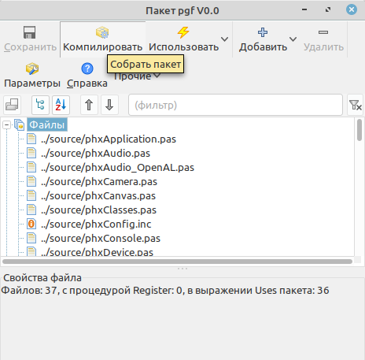

 
# PGF
**About**

The Phoenix Game Framework is a set of classes for helping in the creation of 2D and 3D games in pascal.

It contains classes for API independent device management, platform independent device creating, texture loading, image manipulation, sound support using plugins for different audio engines, input handling, sprite engine, particles, gui and much much more.

One of the main features over other similar engines is the editors that helps in creating spite sheets, bitmap fonts and the other content that is needed for your game.

Phoenix is mainly developed and tested on Linux, but Windows or MacOS is supported and due to the plugin nature of the engine adding support for other platforms is relatively easy.

**Package installation**

Install package dependencies. Open the Network package manager and install the Vampire Imaging Package, Box2d.

 
 

Open and compile pgf.lpk

 

Open and install pgfctrls.lpk

 

**Сreate the first game application**

select> file> create ...

  

and selected PGF Game Application ...

 

compile and run first project ......

**Compilation of PGF in different OS's**

**GNU/Linux**

Additionally for compilation in some distributives you will be needed to install dev-packages, without them you will get “Error while linking …”. Below you can find the list of such packages for common distributives. 

**Debian, Ubuntu, Linux Mint** and any based on them: 

dependencies for graphics provider 

- libglfw3 or libglfw3-wayland (for X or Wayland)
- libsdl2-dev 

dependencies for graphics render

- libfreeimage-dev (not necessary. The default is Vampire imaging library.).

dependencies for audio ( temporarily using the bass library).

 